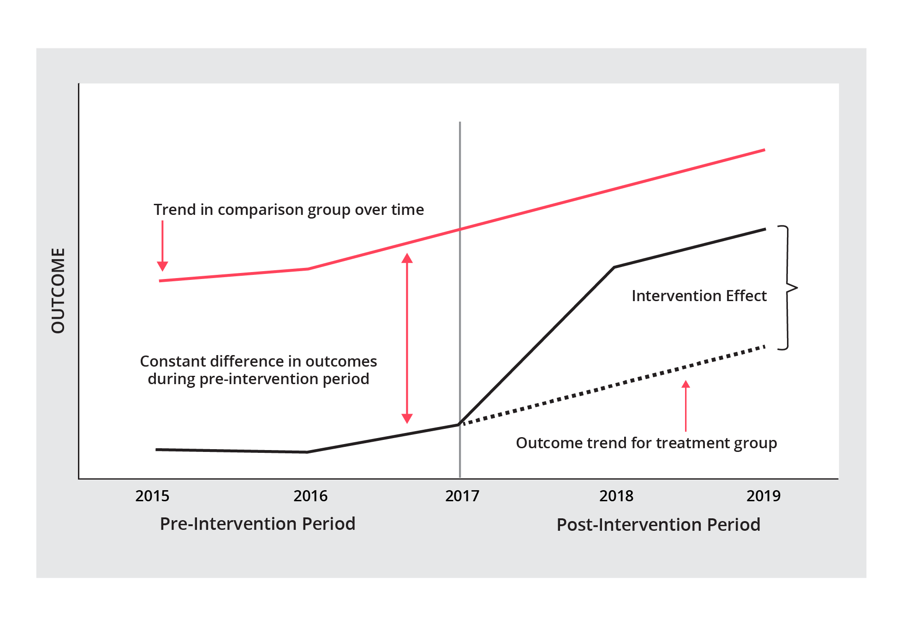

```{r meta, echo=FALSE, message=FALSE, warning=FALSE}
library(metathis)
meta() %>%
  meta_general(
    description = "An examination of California's system of support",
    generator = "xaringan and remark.js"
  ) %>% 
  meta_name("github-repo" = "scoultersdcoe/cera_da") %>% 
  meta_social(
    title = "The Effects of Differentiated Assistance",
    url = "https://cera2021da.netlify.app",
    image = "https://github.com/scoultersdcoe/cera_da",
    image_alt = "Title slide for CERA presentation",
    og_type = "website",
    og_author = "Shannon Coulter",
    twitter_card_type = "summary_large_image",
    twitter_creator = "@scoulte1"
  )

#xaringan::inf_mr()
```

```{r setup, include = FALSE}
options(htmltools.dir.version = FALSE)
library(knitr)
library(tidyverse)
library(xaringanExtra)
library(nhsrtheme)
library(NHSRdatasets)
library(icons)
# set default options
opts_chunk$set(echo=FALSE,
               collapse = TRUE,
               fig.width = 7.252,
               fig.height = 4,
               dpi = 300)
# set engines
knitr::knit_engines$set("markdown")
xaringanExtra::use_tile_view()
xaringanExtra::use_panelset()
xaringanExtra::use_clipboard()
xaringanExtra::use_webcam()
xaringanExtra::use_broadcast()
xaringanExtra::use_share_again()
xaringanExtra::style_share_again(
  share_buttons = c("twitter", "linkedin", "pocket")
)

```

class: title-slide, right, top
background-image: url(img/working.jpg)
background-size: cover

.right-column[
# `r rmarkdown::metadata$title`
### Understanding the Causal Impact<br>of District-level Interventions

**`r rmarkdown::metadata$author`** <br>
`r rmarkdown::metadata$date` <br><br>
CERA 2021 <br>
[DA Report](https://www.sdcoe.net/lls/assessment/Documents/Evaluation/DA_Full_Report.pdf)
]

.left[
.footnote[
Graphic by [Jubjang](https://www.rawpixel.com/image/3112764/free-photo-image-marble-background-aesthetic)
]
]

???

Welcome to the presentation. This presentation is on the effects of differentiated assistance on student achievement, which is being presented today by Shannon Coulter, Dan Wolfson, & Steven Green from the San Diego County Office of Education

---
name: about-us
class: about-us-slide, inverse, middle, left

## About Us

.panelset[
.panel[.panel-name[Shannon Coulter]

```{r fig.show="hide", include=FALSE, picture-knitr-coulter, eval=TRUE}

```
.pull-left[
- Director of Research and Evaluation
- Strategic Data Project Fellowship
]

.pull-right[
```{r, ref.label= "picture-knitr-coulter", out.width="90%"}
```
]
] <!---->

.panel[.panel-name[Dan Wolfson]

```{r fig.show="hide", include=FALSE, picture-knitr-wolfson, eval=TRUE}

```
.pull-left[
- Executive Director of Learning and Leadership Services
- Director California System of Support (San Diego)
]

.pull-right[
```{r, ref.label= "picture-knitr-wolfson", out.width="90%"}
```
]
] <!---->

.panel[.panel-name[Steven Green]


```{r fig.show="hide", include=FALSE, picture-knitr-green, eval=TRUE}

```
.pull-left[
- Senior Director of Assessment, Accountability, and Evaluation
- Director Differentiated Assistance (San Diego)
]

.pull-right[
```{r, ref.label= "picture-knitr-green", out.width="90%"}
```
]
]<!---->
]

???
A little about us. I'm Shannon Coulter, Director of Research and Evaluation, where I have been for the past 11 years. I'm also a former President of CERA, so I really appreciate being here today and seeing all of you. This project was part of a capstone for Harvard's Strategic Data project, where I participated in a fellowship for the past 2 years. 

Dan Wolfson

Steve Green

---
name: section slide
background-image: url(img/camping2.jpg)
background-size: cover

class: left

<br><br><br><br><br><br><br><br><br><br><br><br><br>

<font color = "white">

##Exploring 
###Why the shift in accountability?


???

Steve...

---
name: shifts

## Why Shift?

----

--

####Inequity

Persistent inequities in access and opportunity exist across school districts in California.

--

#### Funding

School funding formulas directed more monies to districts that serve larger percentages of historically marginalized student groups.

--

#### Accountability

Increased accountability of school funding mandated that California’s 54 county offices of education approve districts’ funding and accountability plans and *support districts in addressing performance gaps* across the state’s priorities.


???

Steve. 
There are a number of reasons why we decided to explore the effects of differentiated assistance. 

First, we know we have persistent inequities in access and opportunity in California, Those inequities are present across many student outcomes, but are especially prominent in academics where Hispanic and African-American students trail white and Asian-American students in ELA and mathematics by double digits.

Second, in 2017 school funding models changed and directed more monies to districts that serve larger percentages of marginalized students. Literally billions of dollars that were once allocated to districts based on attendance were re-allocated based on percentages of student groups served.

With the funding changes, our accountability changed. State law mandated that California’s 54 county offices of education approve districts’ funding and accountability plans and support districts in addressing performance gaps across the state’s priorities.

These shifts, initiated by accountability policies, created a different landscape in California and produced *a rich opportunity for us to figure out the causal impact of turning on this assistance for low performing school districts*.

---
name: context-imageCA
class: top, left

## Who's Affected?

----

.pull-left[

#### School Districts

In 2016-17, about one-third of California school districts failed to make adequate progress in addressing critical equity issues, resulting in their eligibility for assistance from county offices of education.<br><br><br>

These districts include small school districts in rural northern California such as Redding School District to the Los Angeles Unified School District.
]

```{r fig.show="hide", include=FALSE, CA-map, eval=TRUE}

```

--

.pull-right[
```{r, ref.label= "CA-map", out.width="80%"}
```
]


???

Steve. 
When the state operationalized DA in the 2016-17 school year, approximately 218 districts of our 1,390 districts and charters were eligible for assistance based on results from the California Schools Dashboard. 

Each of these dots represents a school district across the state that was eligible for assistance from the largest Los Angeles Unified to the smallest Redding School District.

---

name: differentiated assistance
class: top, left


## What Approach?

----

.pull-left[
####Differentiated Assistance is a multi-stage process that

1. Recognizes the school district as the driver of change.

2. Provides professional development in using data, systems analysis, and continuous improvement.

3. Builds capacity of school level teams to improve academic outcomes and close achievement gaps.
]

--

.pull-right[

]

???

Steve.
DA is state assistance provided to districts that fail to meet the performance criteria established by the State Board of Education (SBE). 

As such, DA is a multistage process that utilizes a district-based team of 4-12 members including superintendents, assistant superintendents, directors, principals, and front line staff including teachers, counselors, and support personnel. 

Teams receive individual support from COEs in the form of improvement coaching throughout the DA process, which involves a needs assessment, root cause analysis, and continuous improvement action planning. The figure to the right outlines DA’s theory of action.

---
name: intervention plot

##Does Accountability Matter?

----

.left-column[
<br><br>
Most district-level accountability interventions have limited effects on student learning outcomes. The greatest changes in student achievement occurred when states *invested sufficient resources* into district capacity and when districts and schools *implemented interventions effectively*.
]


```{r fig.show="hide", include=FALSE, ggdotchart, eval=TRUE}

```

.right-column[
```{r, ref.label= "ggdotchart", fig.align='center', out.width="80%"}
```
]

???

Steve.
Here we have illustrated the effects of some accountability initiatives nationwide. 

Some initiatives like Tennessee’s iZones and the Lawrence takeover resulted in large gains in achievement, especially in mathematics. 

New Orleans's reforms took place post Hurricane Katrina. The effects here were also important, but the context (natural disaster) is unlike any of the other reforms. 

Other initiatives however have failed to produce gains in achievement and some of these initiatives show negative effects on students achievement. Tennessee’s ASD school were mostly negative as were Michigan’s School Closure initiatives. These initiatives were the most aggressive in terms of dislocating students and firing teachers and administrators. 

Overall, this research suggests that changes in achievement occurred when states invested sufficient resources into district capacity and when districts and schools implemented interventions effectively. Several of these studies also suggest that less aggressive reform efforts were effective, that is to say, when states provided districts with greater autonomy and additional resources versus simply requiring schools to fire all of its teachers. 

The California System of Support model uses most of this research. It focuses on a process for determining the needs of districts and carrying out a plan to address the needs versus replacing structural components in the system such as principals and teachers. California’s accountability policies also focus on a process to learn and improve versus a corrective process that punishes schools and districts.

---
name: section slide
background-image: url(img/learning2.jpg)
background-size: cover

<br><br><br><br><br><br><br><br><br><br><br>
## Learning

###How can we know that accountability <br>improves student outcomes?


???

Shannon...

---
name: first question
background-color: #ff435b
class: middle, center


`r icons::icon_style(icons::fontawesome("search"), scale = 4)`
# Research Questions

----

###How has assistance changed student achievement?


???

Shannon.
We were interested in learning answers to two major questions. The first question was how assistance changed student achievement. That is to say, in 2016-17, when DA turned on officially for some districts, how did student achievement change?

Overall Considerations?

What is my research question?

What is my treatment effect of interest?

Where is the variance in my outcome?

Where is the variance in my "treatment"?

How many subjects change?

When do they change?

Do they only change in one direction?

How can I ensure the best counterfactual comparisons?

Use within-subjects comparisons where you can

Use time to consider counterfactual trajectories

What assumptions is my model making?

---
name: second question
background-color: #ff435b
class: middle, center


`r icons::icon_style(icons::fontawesome("search"), scale = 4)`
# Research Questions

----

###How has assistance changed the achievement gap in low-income schools?

???

Shannon.
Our second question focused on the achievement gap. We were interested in changes occurring to the achievement gap after the DA policy turned on for districts.

---
name: method
class: 

# Methods

----

.panelset[
.panel[.panel-name[Data]


We used administrative datasets from CDE.

Our panel data included 49,000 unique records for district, grade, standardized test scores, district-level student characteristics, and other district characteristics from 2014-15 to the 2018-19 school year.
]

.panel[.panel-name[Descriptives]

We examined descriptive characteristics for general assistance districts, differentiated assistance districts, and a subset of general assistance districts that experienced both low-status and growth in ELA and math during the year of DA eligibility (2016-2017) but were not eligible for DA.
]

.panel[.panel-name[Difference-in-Differences]

We estimated the impact of differentiated assistance on student achievement by comparing changes over time in districts receiving assistance with changes in similar districts that never received assistance using an econometric approach called a difference-in-differences (DD) analysis. 
]
]
???

Shannon.
Our full dataset included over 49,000 unique records by district, year, grade, and subject. We also captured data on district enrollment, proportion of students receiving free and reduced-price lunch, proportion of English learners, student race and ethnicity demographics, proportion of staff with master’s degrees, average teaching experience, average daily attendance, and district revenue. 

We estimated the impact of assistance using a difference-in-differences design. A DD design takes advantage of natural experiments (like the DA policy change), where something has happened to some but not others. In this case, we have assistance turning on at a specific point in time for some low performing districts but not for others. A DD approach provides robust estimates of the causal effect of a policy change in situations where random assignment is either impractical, impossible, or unethical. 

To use a DD, we observe outcomes in districts who received assistance (treated) and districts not eligible for assistance (control), both before and after the policy change. Armed with our observations, we compute a simple difference between the post policy performance and pre-policy performance across both groups, and then we simply subtract this first difference in the control from the treatment group. In this way, the DD design removes the influence of the pre-policy performance in the first difference and the second difference removes the change that occurred in the control group over the analytic window, which leaves an estimate of the effect of the intervention.

---
name: methods-table

##Descriptives

----

.left-column[
]

```{r fig.show="hide", include=FALSE, descript, eval=TRUE}

```

.right-column[
```{r, ref.label= "descript", fig.align='center', out.width="80%"}
```
]

???

It's important to ensure our two groups have comparable trends in student achievement and similar characteristics. This table allows us to see that Differentiated Assistance districts are very similar to the low-status/growth districts over time. They are very similar except for enrollment mainly due to Los Angelos Unified pulling the average up in the DA group.

---
name: model
class: 

##Model

----
<br>
.center[

$$y_{dgt} = \alpha + \beta_{1}\lambda_{d} + \beta_{2}\gamma_{t} + \beta_{3}\chi_{dt} + \beta_{4}Assist_{dt} * \gamma_{t} + \varepsilon_{dgt}$$
]

<br><br><br>
where $y_{dgt}$ represents the dependent variable, standardized test scores, where ${dg}$ indexes grade level by district (1 if eligible for assistance and 0 otherwise) and ${t}$ indexes years (1 is after the policy, 0 before). $\lambda_{d}$ are the district fixed effects, $\gamma_{t}$ are the year fixed effects, $Assist_{dt}*\gamma_{t}$ is an interaction for assistance and time (and our estimate of impact), $\chi_{dt}$ represents a matrix of covariates historically linked to achievement outcomes, including percent eligible for FRPM, percent of district demographic composition, and enrollment, $\varepsilon_{dgt}$ is an error term clustered at the district level since assistance is a district-level intervention.


???
Shannon.
We  compared differentiated assistance districts to a subset of 270 
general assistance districts with both low status and growth in 2017, the same year our assistance policy turned on for some districts. We constructed this restricted sample using the California Schools Dashboard, which assigns every district a color based on its performance. THE CDE calculates each district's performance based on data from current and prior years, resulting in a five color-coded performance levels for each indicator. Our comparison districts performance increased by less than 15 points, had low or very low status, and were not eligible for assistance. Most of these districts were orange on the Dashboards's five-by-five colored table compared to DA districts, which were mostly red.

---
name: DD

## Difference-in-Differences

----

.left-column[
<br><br>
DD makes use of longitudinal data from treatment and control groups to obtain a counterfactual to estimate a causal effect. DD estimates the effect of a specific intervention by comparing the changes in outcomes over time between a population that is enrolled in a program and a population that is not.
]

```{r fig.show="hide", include=FALSE, did-explain, eval=TRUE}

```

.right-column[
```{r, ref.label= "did-explain", fig.align='center', out.width="80%"}
```
]

???

Shannon.
So this is what a DD design is doing behind the scenes. DD makes use of longitudinal data from treatment and control groups to obtain an appropriate counterfactual to estimate a causal effect. DD estimates the effect of a specific intervention by comparing the changes in outcomes over time between a population that is enrolled in a program and a population that is not.

---
name: comparison

##Comparison

----
.left-column[
<br><br>
Our study represents two group: the bottom  line represents the trends in DA districts and the line above is our comparison group of similar districts. The top solid line is the achievement of all other districts not receiving assistance.
]
```{r fig.show="hide", include=FALSE, ela-comparison, eval=TRUE}

```

.right-column[
```{r, ref.label= "ela-comparison", fig.align='center', out.width="80%"}
```
]
???

Shannon.
Shannon.*Similar districts*. We compared districts receiving assistance to non assistance districts who experienced low status and growth on the California Schools Dashboard. The lower dashed line represents a subset of 270 non assistance districts with both low status and growth in 2017, the same year our assistance policy turned on for some districts. We constructed this sample using the California Schools Dashboard, which assigns every district a color based on its performance. The California Department of Education calculates each district’s performance based on data from current and prior years, resulting in five color-coded performance levels for each indicator. Red areas on the table represent very low status and change, whereas blue reflects high status and change. Our comparison group comprised districts whose performance increased by less than 15 points, had low or very low status, and were not eligible for assistance. Most of these districts were orange on the Dashboard’s five-by-five colored table compared to DA districts, which were mostly red.

The figure depicts differences between three groups. The dotted line represents the performance of differentiated assistance districts across our analytic window, while the dashed line represents the performance of the subset of 270 low status and growth general assistance districts. Comparatively, the solid line represents districts with high status, those districts in the green and blue on the California Schools Dashboard. It is highly improbable that any of these districts would become eligible for DA. As evidenced in the graph, their performance actually improved during the eligibility year.

---
name: results-1

## Results

----

.left-column[

<br><br>These effects represent the mean difference between the assistance and non-assistance groups in standard deviation units. For both years and across both ELA and math the mean difference in the assistance districts compared to the non-assistance districts was no different from zero.
]
```{r fig.show="hide", include=FALSE, achievement, eval=TRUE}

```

.right-column[
```{r, ref.label= "achievement", fig.align='center', out.width="80%"}
```
]

???

Shannon.
What’s the effect of assistance on achievement?

These effects represent the mean difference between the treatment and control group in standard deviation units. So in Year 1 in ELA the mean difference in the assistance districts was .002 standard deviations lower than in non-assistance districts. The magnitude of this difference is extremely small and not detectably different from zero. In fact none of these differences are statistically different from zero. In plain language, assistance districts performed no better or worse than non assistance districts during the post policy years.

Estimates in mathematics were similar. Mathematics test scores on average declined by .006 standard deviations in year one and by .005 standard deviations in year two relative to the control group. The effects were not significantly
different from zero.

---
name: results-2

## Results

----
.left-column[
<br><br>The achievement gap between low-income districts receiving assistance relative to other groups decreased modestly after the first year after the policy change in both ELA and math. These effects appear to dissipate in year two. Unfortunately, none of the results are significantly different from zero.
]
```{r fig.show="hide", include=FALSE, achievement-gap, eval=TRUE}

```

.right-column[
```{r, ref.label= "achievement-gap", fig.align='center', out.width="80%"}
```
]

???

Shannon.
Effect of assistance on the achievement gap.

This model examined the question about the effect of assistance on the achievement gap. Here we took all treated and control districts and divided them into low-income vs. non-low income districts, which creates 4 groups: Treated low-income, treated non-low income and so on.

We then examined the achievement gap between low-income districts receiving assistance relative to other groups. These differences indicate the achievement gap in ELA decreased by .042 standard deviations in the first year after the policy change and increased by .004 standard deviations after the second year of the policy change. In mathematics, the achievement gap decreased by .028 standard deviations in the first year and by .016 standard deviations in year two. 

However, none of the results are significantly different from zero. All we can say is that the achievement gap remained about the same between assistance and non-assistance districts across our analytic window.


---
name: section slide
background-image: url(img/improve.jpg)
background-size: cover

<br><br><br><br><br><br><br><br><br><br><br>
## Doing

###How can we make the DA <br>process better?


???

Dan

---
name: takeaways
background-color: #ff435b
class: middle, center

`r icons::icon_style(icons::fontawesome("upload"), scale = 4)`
# Key Takeaways

---
name: takeaways-1

## Key Takeaways

.panelset[
.panel[.panel-name[Improvements]

#### Improvements &nbsp;&nbsp; `r icons::icon_style(icons::fontawesome("chart-line"), scale = 1)`

California’s technical support model is a complex set of actions designed to provide financial resources to build capacity of districts to improve their systems without forcing districts to make impulsive structural changes to personnel and resources. Research suggests it may take three to five years to see improvement given these actions (Berends, Bodily, & Kirby, 2002).
]

.panel[.panel-name[Social Stigma]

#### Social Stigma &nbsp;&nbsp; `r icons::icon_style(icons::fontawesome("share-alt"), scale = 1)`

The social stigma of accountability labels alone may lead to contractions in school performance in some districts that are difficult to overcome.
]

.panel[.panel-name[District Interventions]

#### District Interventions &nbsp;&nbsp; `r icons::icon_style(icons::fontawesome("hands-helping"), scale = 1)`

District level interventions may be limited in how much they truly impact student achievement. The magnitude of district level effects range from - 0.3 to a + 0.3 with the median being no change. 
]

.panel[.panel-name[Consistency]

#### Consistency &nbsp;&nbsp; `r icons::icon_style(icons::fontawesome("clone"), scale = 1)`

Differentiated assistance may be limited due to the consistency and fidelity of implementation across county offices of education. Examinations of DA implementation have revealed varying levels of capacity and expertise in COEs, loose implementation and facilitation of the DA process, and delays in the process that result from the release of accountability data (Humphrey & O’Day, 2019). 
]
]

???


Dan.

Improvements. DA has the right theory of action--Program Improvement is not the solution.

Social Stigma. "Ashenfelter Dip" when low performers know that someone is watching their performance, the tend to perform worse; when high performers know someone's watching, they tend to perform better. These are called "anticipation effects" or when someone responds in a positive or negative way depending on how they anticipate things will go.

District Interventions. Baseball analogy. Impact of county office is like determining how much a general manager in baseball contributed to a team winning the World Series.

Consistency. There's a lot of variation across the system in terms of DA implementation, which leads to different outcomes for different LEAs.


---
name: implications
background-color: #ff435b
class: middle, center

`r icons::icon_style(icons::fontawesome("clipboard-list"), scale = 4)`
# Implications

---
name: implications-1

## Implications

--

#### Stay the course &nbsp;&nbsp; `r icons::icon_style(icons::fontawesome("road"), scale = 1)`

Policymakers should continue to provide assistance. DA’s theory of action addresses the intended changes necessary for all students to succeed in California schools along with the actions necessary to achieve those changes. 

--

#### Wait longer on results &nbsp;&nbsp; `r icons::icon_style(icons::fontawesome("hourglass-half"), scale = 1)`

Policymakers should exercise patience since improvements in student achievement may take 3-5 years. 

--

#### Smooth the path &nbsp;&nbsp; `r icons::icon_style(icons::fontawesome("wave-square"), scale = 1)`

Policymakers should use the current pause in accountability to make improvements to the fidelity of the intervention. 

???

Dan.
The research supporting differentiated assistance is sound. It aims to get at the root cause of low student achievement, not just find a Band-aid or temporary solution. It also focuses on district systems, which is the place where the greatest change can happen to improve schools.

Improvements in student achievement could take three to five years. Also, the pause in accountability due to the pandemic offers the opportunity for county offices of education to make strides in what’s working, what isn’t and make improvements as well as increase consistency in how differentiated assistance is delivered and measured.


---
name: implementation-guide
class: inverse, middle, center

`r icons::icon_style(icons::fontawesome("parachute-box"), scale = 4)`

## Implementation Guide

[Implementation Guide](https://www.sdcoe.net/lls/assessment/Pages/evaluation-reports.aspx)

???

Dan. Link to implementation guide.

---
name: thank-you
class: inverse, middle, center

# Thank you!

### Here's where you can find us...

[Shannon Coulter](scoulter@sdcoe.net) | 
[@scoultersdcoe `r icons::fontawesome("github")`](https://github.com/scoultersdcoe)<br/>
[Dan Wolfson](dwolfson@sdcoe.net) `r icons::icon_style(icons::fontawesome("circle"), scale = .5)`
[Steven Green](steven.green@sdcoe.net)

???

Dan. Our contact information.

